# Projeto TCC - Instituto Federal IFSP

## Andamento do Projeto
Mesmo após a conclusão do curso e do projeto, ainda busco o melhorar cada dia mais, para que se torne um sistema completo.
Atualmente estou trabalhando:
* Melhorando a area de ADMIN e sua segurança.
* A parte do envio de orçamentos.

## Resumo do Projeto 
Para o trabalho de conclusão de curso efetuamos um levantamento das empresas proximas de nosso região e suas principais dificudaldes em divulgação e atendimento ao publico. Com base nas pesquisas escolhemos um studio de tatuagens da região que não possuia portifolio online e nem um sistema que o auxilia-se. 
As dificuldades levantadas pelo nosso cliente foi a divulgação do seu trabalho e organização de horarios, com o objetivo de resolver esses problemas foi desenvolvido um sistema Web com as ferramentas necessarias para auxiliar nosso cliente.

* Sistema WEB com interface Portifolio, divulgando os trabalhos, serviços e historia do studio/cliente.
* Campo de Depoimentos, onde os clientes do studio podem deixar suas avaliações do trabalho.
* Uma galeria de fotos atrelada ao Instagram do Studio, para divulgação dos trabalhos.
* Um campo para contato, onde é possivel tirar duvidas e deixar mensagens.
* Um mapa da localização do Studio.
* Uma area de ADMIN protegida por senha para gerenciar o sistema. / Em andamento
* Um botão flutuante onde o cliente do studio pode mandar um orçamento com imagem, local e tamanho da tatuagem. / Em andamento
* Uma Agenda onde o cliente do studio pode verificar os horarios diponiveis e marca o trabalho em um horario Vago. / Em andamento
 
## O Sistema 
A aplicação WEB é totalmente responsivo, se adaptando de acordo com o aparelho utilizado. Foi baseado no sistema CRUD (Create, Read, Update, Delete).

## Linguagens Utilizadas
HTML, CSS, JavaScript e o framework Bootstrap, PHP juntamente com o framework codeigniter 3, Banco de dados MySQL com PhpMyAdmin.

## Screenshots

## Smartfone
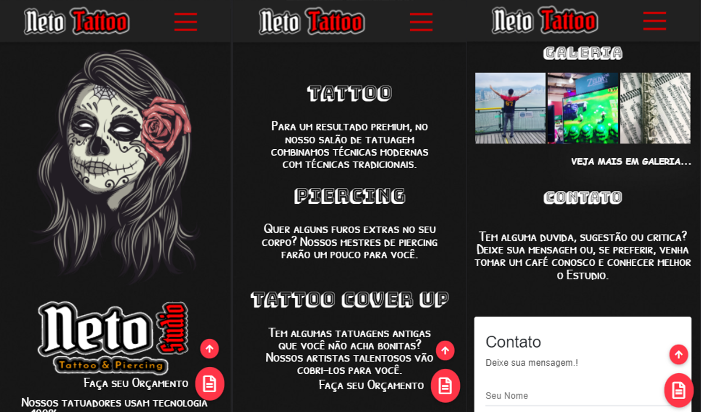
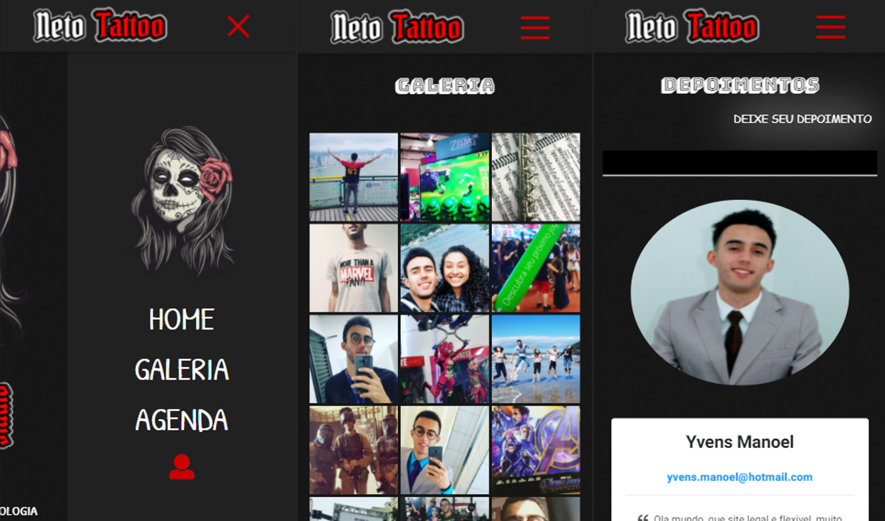
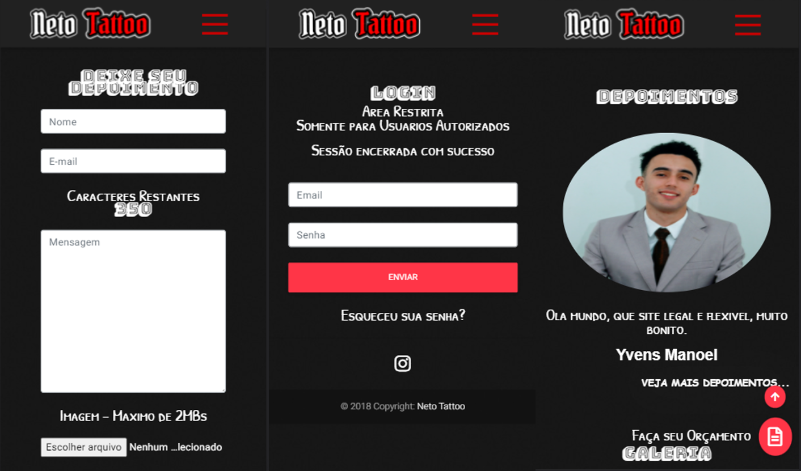

## Desktop
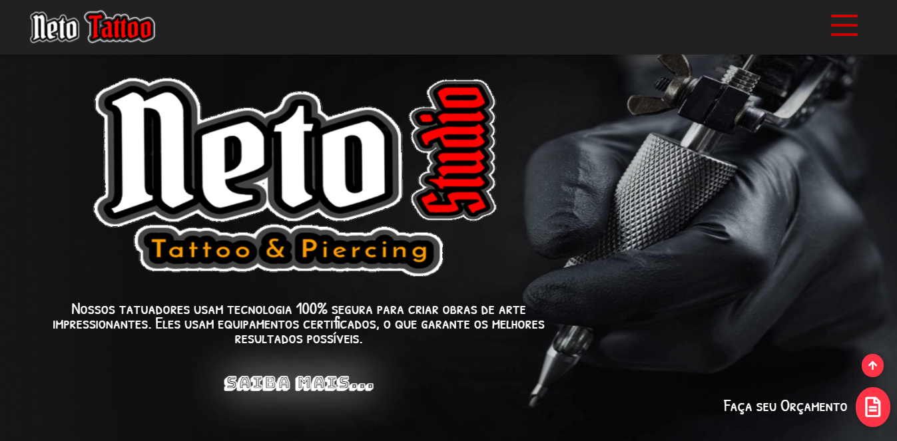
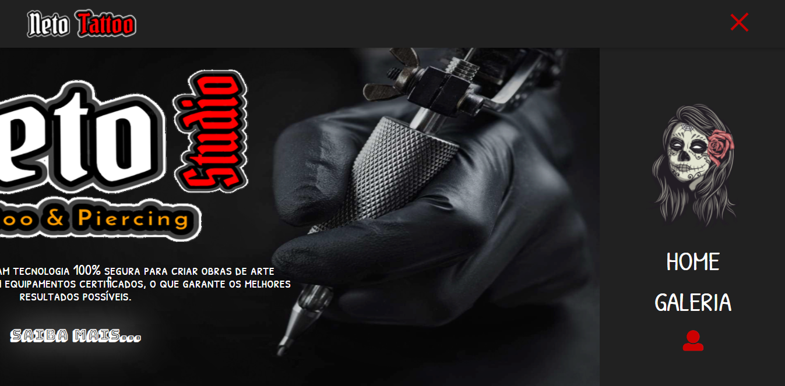
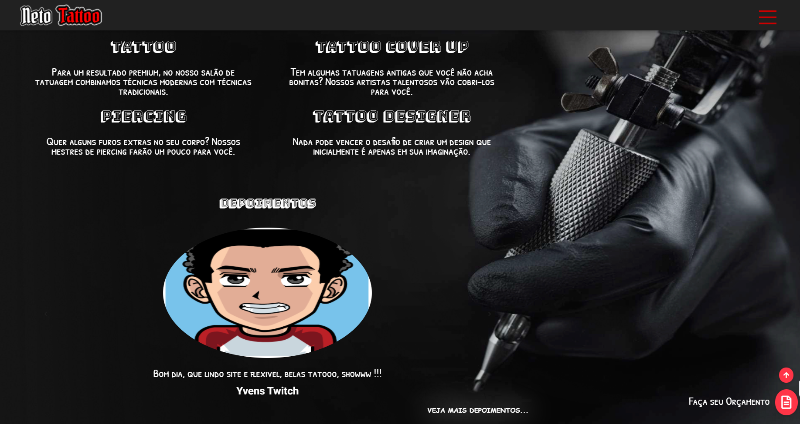
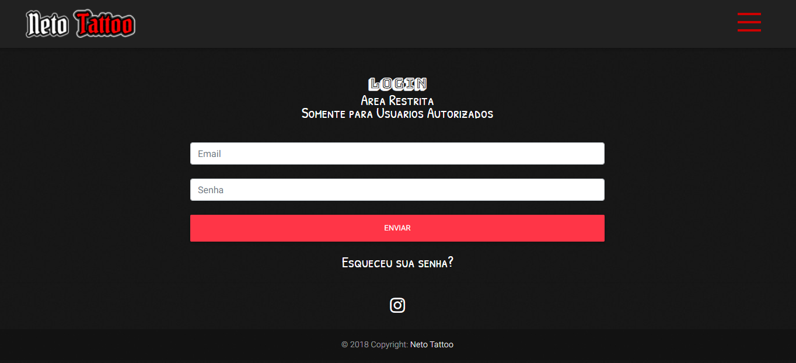
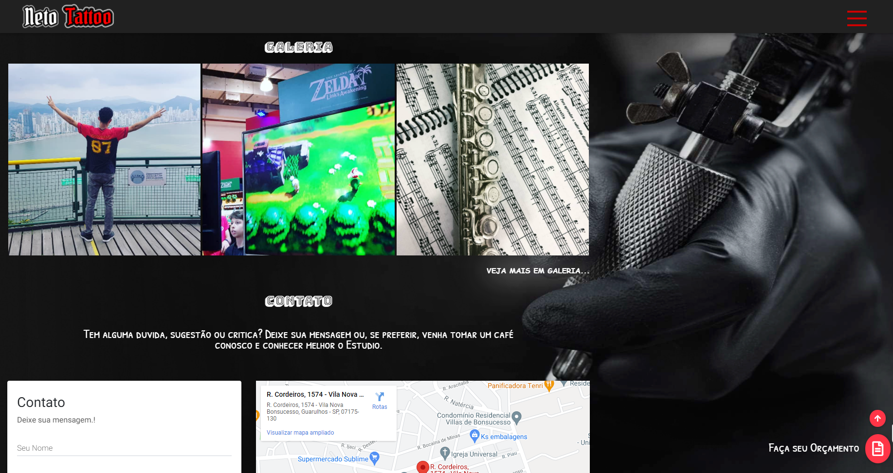
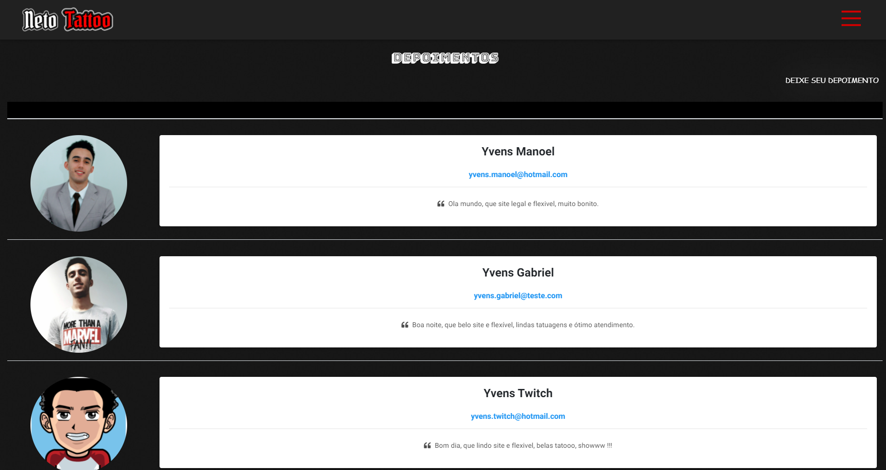
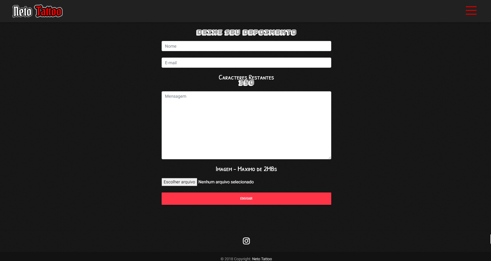
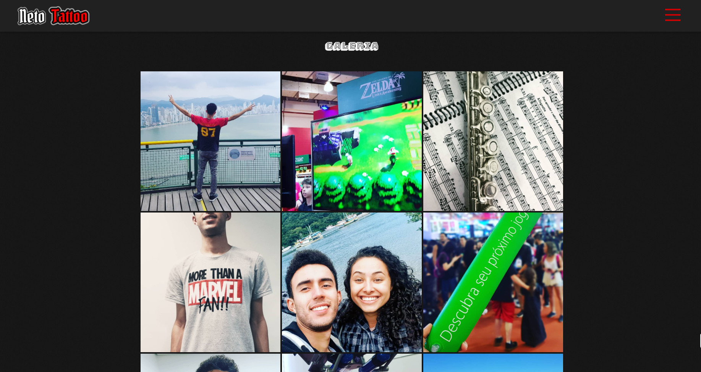

